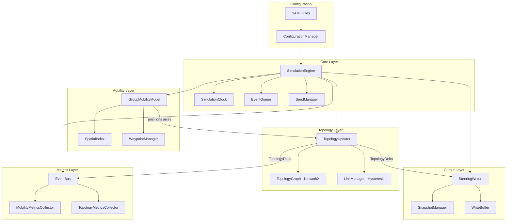
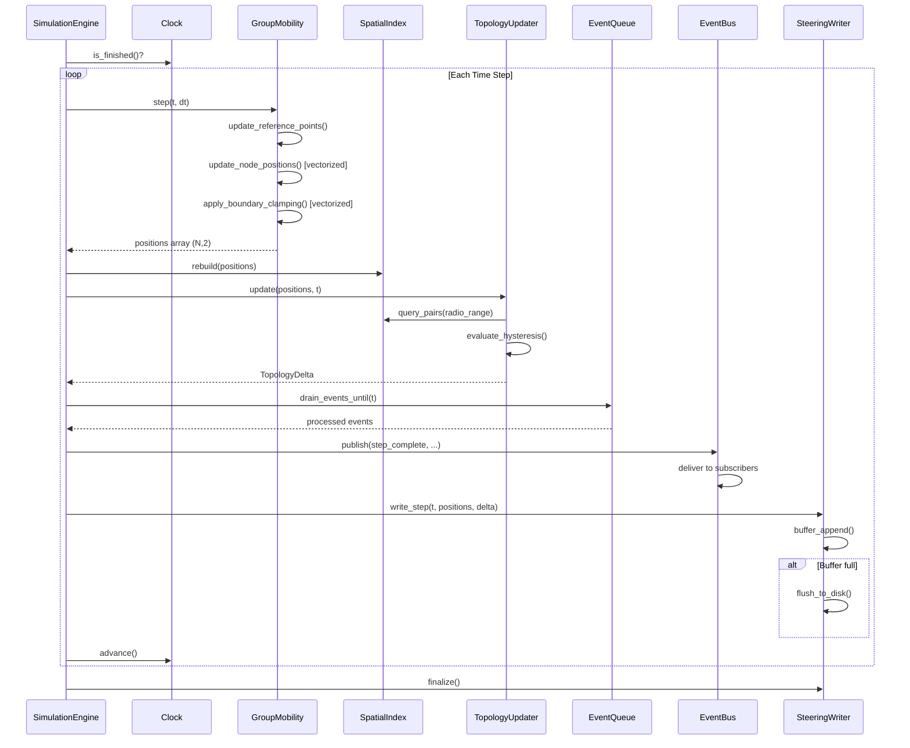

# Design Document: MANET Simulation Engine

## Overview

This document describes the technical design for the core MANET Simulation Engine — a Python-based simulator for 1,000 mobile nodes across a 10,000 square mile area (100×100 miles) over a 1-hour duration. The engine uses a hybrid time-stepped + event-driven architecture with the Reference Point Group Mobility (RPGM) model organizing nodes into 20 groups of 50.

The design prioritizes three principles:
1. **Separation of concerns** — Mobility, topology, network, and output layers communicate through typed data contracts
2. **Output-first design** — Throughput and correctness of steering file serialization over interactive feedback
3. **Reproducibility** — All randomness seeded and recorded; identical seed + config = identical output

### Key Design Decisions

| Decision | Rationale |
|----------|-----------|
| Hybrid time-stepped + event-driven loop | Pure event-driven creates millions of events/second for continuous mobility; pure time-stepped wastes cycles. Hybrid gives regular mobility updates with sub-second event precision. |
| NumPy float32 arrays for positions/velocities | Vectorized batch operations eliminate Python loop overhead; float32 halves memory vs float64 while providing sufficient precision for mile-scale coordinates. |
| Grid-based spatial index (cell_size = radio_range) | O(n·k) neighbor queries vs O(n²) brute force. Grid preferred over cKDTree for this use case because rebuild cost is O(n) vs O(n log n), and RPGM clustering is bounded. |
| NetworkX undirected graph for topology | Mature API for connectivity analysis (components, clustering, degree). Edge/node attribute storage aligns with steering file output needs. |
| Hysteresis-based link management | Prevents link flapping near radio range boundary, producing more realistic and stable topology deltas. |
| Buffered JSON output with configurable flush interval | Avoids I/O bottleneck; keeps memory bounded while ensuring no data loss on normal completion. |
| Event bus (pub/sub) for metrics | Decouples collection from simulation logic; collectors can be added/removed without touching core code. |

## Architecture



### Simulation Loop Sequence



## Components and Interfaces

### 1. ConfigurationManager

**Module:** `core/config.py`

Loads and validates YAML configuration. Provides typed access to all simulation parameters.

```python
@dataclass
class SimulationConfig:
    duration_seconds: float        # 1.0 - 86400.0, default 3600
    step_size: float               # 0.001 - 3600.0, default 1.0
    seed: Optional[int]            # 0 - 2^32-1, or None for auto-generate
    area_width: float              # 1.0 - 1000.0 miles
    area_height: float             # 1.0 - 1000.0 miles
    node_count: int                # 1 - 10000
    mobility: MobilityConfig
    network: NetworkConfig
    output: OutputConfig

@dataclass
class MobilityConfig:
    model: str                     # "rpgm"
    num_groups: int                # default 20
    group_speed_min_mps: float     # 0.5 m/s
    group_speed_max_mps: float     # 13.4 m/s
    pause_min_seconds: float       # 0
    pause_max_seconds: float       # 300
    max_deviation_miles: float     # 1.25
    deviation_model: str           # "uniform" or "gaussian"

@dataclass
class NetworkConfig:
    radio_range_miles: float       # default 1.0
    hysteresis_margin_pct: float   # default 0.10 (10% of radio range)

@dataclass
class OutputConfig:
    format: str                    # "json"
    output_dir: str
    snapshot_interval: int         # seconds, default 60
    buffer_size: int               # steps, default 100, max 1000
```

**Interface:**
- `load(path: str) -> SimulationConfig` — Parse YAML, validate ranges, return typed config
- `validate(config: dict) -> list[str]` — Return list of validation errors (empty = valid)

### 2. SimulationClock

**Module:** `core/clock.py`

Deterministic clock with configurable step size. Handles partial final step.

```python
class SimulationClock:
    def __init__(self, start: float, end: float, step_size: float): ...
    @property
    def current_time(self) -> float: ...
    def is_finished(self) -> bool: ...
    def advance(self) -> None: ...  # Handles partial final step
```

### 3. SeedManager

**Module:** `core/seed_manager.py`

Manages RNG seeding for reproducibility. Creates independent Generator instances for each subsystem.

```python
class SeedManager:
    def __init__(self, seed: Optional[int] = None): ...
    @property
    def seed(self) -> int: ...  # The seed used (generated if not provided)
    def get_rng(self, subsystem: str) -> np.random.Generator: ...
```

### 4. EventQueue

**Module:** `core/event_queue.py`

Min-heap priority queue for discrete events with millisecond resolution.

```python
@dataclass(order=True)
class ScheduledEvent:
    time: float
    priority: int
    callback: Callable = field(compare=False)

class EventQueue:
    def schedule(self, time: float, callback: Callable, priority: int = 0) -> None: ...
    def drain_until(self, t: float) -> int: ...  # Returns count of processed events
    def is_empty(self) -> bool: ...
```

### 5. GroupMobilityModel (RPGM)

**Module:** `mobility/group_mobility.py`

Implements Reference Point Group Mobility with vectorized position updates.

```python
class GroupMobilityModel:
    def __init__(self, config: MobilityConfig, rng: np.random.Generator): ...
    def initialize(self, node_count: int, area_width: float, area_height: float) -> None: ...
    def step(self, t: float, dt: float) -> np.ndarray: ...  # Returns positions (N, 2)
    def get_positions(self) -> np.ndarray: ...
    def get_velocities(self) -> np.ndarray: ...
    def get_group_ids(self) -> np.ndarray: ...
```

**Internal state:**
- `positions: np.ndarray` — shape (N, 2), float32
- `velocities: np.ndarray` — shape (N, 2), float32
- `group_ids: np.ndarray` — shape (N,), int32
- `groups: list[Group]` — Group reference points, waypoint queues, pause states

### 6. SpatialIndex

**Module:** `mobility/spatial_index.py`

Grid-based spatial hash with cell_size = radio_range. Rebuilt each step from positions array.

```python
class GridSpatialIndex:
    def __init__(self, width: float, height: float, cell_size: float): ...
    def rebuild(self, positions: np.ndarray) -> None: ...  # O(n)
    def query_radius(self, x: float, y: float, radius: float) -> list[int]: ...
    def query_pairs(self, radius: float) -> set[tuple[int, int]]: ...  # All pairs within radius
```

**Alternative:** `scipy.spatial.cKDTree` rebuilt each step via `query_pairs(r=radius)`.

### 7. TopologyUpdater

**Module:** `topology/topology_updater.py`

Reconciles positions into topology changes using hysteresis-based link management.

```python
@dataclass
class TopologyDelta:
    timestamp: float
    new_links: list[tuple[int, int, float]]      # (node_a, node_b, distance)
    broken_links: list[tuple[int, int]]           # (node_a, node_b)

class TopologyUpdater:
    def __init__(self, config: NetworkConfig): ...
    def initialize(self, positions: np.ndarray) -> TopologyDelta: ...
    def update(self, positions: np.ndarray, t: float) -> TopologyDelta: ...
    def get_graph(self) -> nx.Graph: ...
```

### 8. LinkManager (Hysteresis)

**Module:** `topology/link_manager.py`

Manages link state transitions with hysteresis buffer zone.

```python
class LinkState(Enum):
    ABSENT = auto()
    ACTIVE = auto()

class LinkManager:
    def __init__(self, radio_range: float, hysteresis_pct: float): ...
    def evaluate(self, current_state: LinkState, distance: float) -> LinkState: ...
    @property
    def inner_threshold(self) -> float: ...  # radio_range - margin
    @property
    def outer_threshold(self) -> float: ...  # radio_range + margin
```

### 9. SteeringWriter

**Module:** `output/steering_writer.py`

Buffered JSON output with configurable flush intervals and snapshot support.

```python
class SteeringWriter:
    def __init__(self, config: OutputConfig, metadata: dict): ...
    def open(self) -> None: ...
    def write_step(self, t: float, positions: np.ndarray, velocities: np.ndarray,
                   group_ids: np.ndarray, delta: TopologyDelta) -> None: ...
    def close(self) -> None: ...  # Flush remaining buffer, write closing structure
```

### 10. SteeringParser

**Module:** `output/steering_parser.py`

Reads steering files back into simulation state objects.

```python
class SteeringParser:
    def parse(self, filepath: str, timestep: float) -> SimulationState: ...
    def validate_schema(self, filepath: str) -> list[str]: ...

class SteeringPrinter:
    def format(self, state: SimulationState) -> str: ...  # 2-space indent, sorted keys
```

### 11. EventBus

**Module:** `core/event_bus.py`

Publish-subscribe for decoupled metrics collection.

```python
class EventBus:
    def subscribe(self, event_type: str, handler: Callable) -> str: ...  # Returns subscription ID
    def unsubscribe(self, subscription_id: str) -> None: ...
    def publish(self, event_type: str, payload: Any) -> None: ...
    def enable(self, subscription_id: str) -> None: ...
    def disable(self, subscription_id: str) -> None: ...
```

**Event types:** `position_update`, `link_formed`, `link_broken`, `step_complete`, `simulation_end`

### 12. MetricsCollectors

**Module:** `network/metrics.py`

```python
class MobilityMetricsCollector:
    def __init__(self, snapshot_interval: float, output_dir: str): ...
    # Subscribes to: position_update, step_complete, simulation_end

class TopologyMetricsCollector:
    def __init__(self, snapshot_interval: float, output_dir: str): ...
    # Subscribes to: link_formed, link_broken, step_complete, simulation_end
```

## Data Models

### Node State (Array-of-Structs via NumPy)

Rather than individual Node objects, the engine stores node state in contiguous NumPy arrays for vectorized operations:

```python
# Core state arrays (owned by GroupMobilityModel)
positions: np.ndarray   # shape (N, 2), dtype=float32, units: miles
velocities: np.ndarray  # shape (N, 2), dtype=float32, units: miles/second
group_ids: np.ndarray   # shape (N,), dtype=int32
active: np.ndarray      # shape (N,), dtype=bool
```

**Memory budget per node (core state):** 4×float32 + 1×int32 + 1×bool = 21 bytes
**1,000 nodes:** ~21 KB core state (well within the 200 KB budget from Req 6.4)

### Node Serialization Format

```json
{
  "node_id": 42,
  "group_id": 2,
  "x": 54.123456,
  "y": 78.654321,
  "vx": 0.0012,
  "vy": -0.0008,
  "transmission_range": 1.0,
  "active": true
}
```

### Group Data Structure

```python
@dataclass
class Group:
    group_id: int
    member_ids: list[int]           # Ordered by join time (first = longest-tenured)
    leader_id: int                  # Index into member_ids[0] initially
    reference_point: np.ndarray     # shape (2,), float32, miles
    reference_velocity: np.ndarray  # shape (2,), float32, miles/second
    waypoint_queue: deque[np.ndarray]  # FIFO, capacity 1-100
    pause_remaining: float          # seconds
    current_speed: float            # miles/second
```

### TopologyDelta

```python
@dataclass
class TopologyDelta:
    timestamp: float
    new_links: list[LinkEvent]
    broken_links: list[LinkEvent]

@dataclass
class LinkEvent:
    node_a: int
    node_b: int
    distance: float
    timestamp: float
```

### Steering File Schema

```json
{
  "metadata": {
    "schema_version": "1.0.0",
    "seed": 42,
    "config": { "...all user-specified params..." },
    "simulation_start": "2024-01-01T00:00:00Z",
    "simulation_end": "2024-01-01T01:00:00Z",
    "total_steps": 3600,
    "node_count": 1000
  },
  "steps": [
    {
      "timestamp": 0.0,
      "nodes": [ { "node_id": 0, "group_id": 0, "x": 50.1, "y": 23.4, "vx": 0.001, "vy": -0.002 } ],
      "links_formed": [ { "node_a": 0, "node_b": 5, "distance": 0.8, "timestamp": 0.0 } ],
      "links_broken": []
    }
  ],
  "snapshots": [
    {
      "timestamp": 60.0,
      "adjacency": { "0": [5, 12, 47], "1": [3, 8] },
      "nodes": [ { "node_id": 0, "x": 50.2, "y": 23.5, "vx": 0.001, "vy": -0.002, "group_id": 0 } ]
    }
  ]
}
```

### Configuration Schema (YAML)

```yaml
simulation:
  duration_seconds: 3600          # 1 - 86400
  step_size: 1.0                  # 0.001 - 3600.0
  seed: 42                        # 0 - 4294967295, optional
  area:
    width_miles: 100.0            # 1.0 - 1000.0
    height_miles: 100.0           # 1.0 - 1000.0

nodes:
  count: 1000                     # 1 - 10000

mobility:
  model: rpgm
  num_groups: 20
  group_speed_min_mps: 0.5
  group_speed_max_mps: 13.4
  pause_min_seconds: 0
  pause_max_seconds: 300
  max_deviation_miles: 1.25
  deviation_model: uniform        # uniform | gaussian

network:
  radio_range_miles: 1.0
  hysteresis_margin_pct: 0.10

output:
  format: json
  output_dir: ./steering_output
  snapshot_interval: 60           # 1 - 3600
  buffer_size: 100                # 1 - 1000
```

### Event Bus Payload Types

```python
@dataclass
class PositionUpdateEvent:
    timestamp: float
    positions: np.ndarray       # (N, 2) reference, not copy
    velocities: np.ndarray      # (N, 2) reference

@dataclass
class LinkFormedEvent:
    timestamp: float
    node_a: int
    node_b: int
    distance: float

@dataclass
class LinkBrokenEvent:
    timestamp: float
    node_a: int
    node_b: int

@dataclass
class StepCompleteEvent:
    timestamp: float
    step_number: int
    active_links: int
    wall_clock_ms: float

@dataclass
class SimulationEndEvent:
    total_time: float
    total_steps: int
    wall_clock_seconds: float
```

## Correctness Properties

*A property is a characteristic or behavior that should hold true across all valid executions of a system — essentially, a formal statement about what the system should do. Properties serve as the bridge between human-readable specifications and machine-verifiable correctness guarantees.*

### Property 1: Configuration round-trip

*For any* valid configuration dictionary with all required fields and values within acceptable ranges, serializing it to YAML and loading it via ConfigurationManager SHALL produce a SimulationConfig whose fields match the original dictionary values.

**Validates: Requirements 2.1**

### Property 2: Configuration validation error reporting

*For any* configuration dictionary with one or more fields set to values outside their acceptable ranges, the ConfigurationManager SHALL raise an error that identifies each invalid field name, its provided value, and the acceptable range — and the set of reported fields SHALL exactly equal the set of fields with out-of-range values.

**Validates: Requirements 2.2, 2.3**

### Property 3: Clock advancement reaches exact end time

*For any* valid duration (1.0–86400.0) and step_size (0.001–3600.0) where step_size <= duration, advancing the SimulationClock to completion SHALL result in a final current_time exactly equal to the configured end time, regardless of whether duration is evenly divisible by step_size.

**Validates: Requirements 3.1, 3.3, 3.5**

### Property 4: Simulation reproducibility

*For any* valid seed (0 to 2^32-1) and valid configuration, running the simulation twice with the same seed and configuration SHALL produce bit-for-bit identical steering file output, and the output metadata SHALL contain the seed used.

**Validates: Requirements 4.1, 4.2, 4.3**

### Property 5: Event queue ordering

*For any* set of scheduled events with arbitrary timestamps and priorities, draining the queue up to time T SHALL process all events with timestamp <= T in order of (timestamp ascending, priority ascending), and SHALL not process any event with timestamp > T.

**Validates: Requirements 5.2, 5.3**

### Property 6: Node serialization completeness

*For any* valid node state (position in [0,100]², velocity, group_id, transmission_range, active status), serializing to a dictionary SHALL produce a dict containing keys node_id, group_id, x, y, vx, vy, transmission_range, and active, with numeric values rounded to no more than 6 decimal places.

**Validates: Requirements 6.2**

### Property 7: Position array shape invariant

*For any* sequence of mobility updates on N nodes, the positions array SHALL maintain shape (N, 2) with dtype float32 (or float64) after every step.

**Validates: Requirements 6.3, 9.1**

### Property 8: Group membership add-then-remove identity

*For any* group and any node_id not already in the group, adding the node then removing it SHALL return the group to its original member list (excluding the added node).

**Validates: Requirements 7.2, 7.4**

### Property 9: Duplicate member rejection

*For any* group and any node_id that is already a member, attempting to add that node_id again SHALL be rejected and the group's member list SHALL remain unchanged.

**Validates: Requirements 7.3**

### Property 10: Leader succession on removal

*For any* group with at least 2 members where the leader is removed, the new leader SHALL be the longest-tenured remaining member (first in the ordered member list after the removed leader).

**Validates: Requirements 7.5**

### Property 11: Boundary clamping invariant

*For any* set of node positions and velocities after a mobility update step, all position components SHALL be within [0, area_width] for x and [0, area_height] for y, regardless of the velocity magnitudes or directions applied.

**Validates: Requirements 8.4, 8.6, 9.3**

### Property 12: Member deviation bounds

*For any* node at any time step, the Euclidean distance from that node's position to its group's reference point SHALL not exceed the configured max_deviation (1.25 miles).

**Validates: Requirements 8.3**

### Property 13: Waypoint queue non-exhaustion

*For any* group whose waypoint queue becomes empty during a step, the mobility model SHALL generate at least 1 new waypoint before the next movement calculation, ensuring the queue is never empty when movement is needed.

**Validates: Requirements 8.5**

### Property 14: Vectorized position update correctness

*For any* positions array P of shape (N, 2), velocities array V of shape (N, 2), and time delta dt > 0, the vectorized position update SHALL produce a result equal to P + V * dt (element-wise), before boundary enforcement is applied.

**Validates: Requirements 9.2**

### Property 15: Velocity reflection at boundary

*For any* node whose position reaches or exceeds a simulation area boundary after a position update, the corresponding velocity component SHALL be negated (sign flipped) via a vectorized boolean mask operation.

**Validates: Requirements 9.4**

### Property 16: Spatial index zero false negatives

*For any* set of N node positions and any query point with radius R, the spatial index radius query SHALL return a superset of (or exactly) the set of node IDs whose Euclidean distance from the query point is <= R. There SHALL be zero false negatives.

**Validates: Requirements 10.1**

### Property 17: Hysteresis link formation

*For any* pair of nodes in ABSENT link state whose distance falls below the inner threshold (radio_range - hysteresis_margin), the link state SHALL transition to ACTIVE.

**Validates: Requirements 12.1**

### Property 18: Hysteresis link teardown

*For any* pair of nodes in ACTIVE or HYSTERESIS link state whose distance exceeds the outer threshold (radio_range + hysteresis_margin), the link state SHALL transition to ABSENT.

**Validates: Requirements 12.2**

### Property 19: Hysteresis stability in buffer zone

*For any* pair of nodes whose distance is between the inner threshold and outer threshold (the hysteresis zone), the link state SHALL remain unchanged — ACTIVE pairs stay ACTIVE, ABSENT pairs stay ABSENT.

**Validates: Requirements 12.3, 12.6**

### Property 20: Topology delta correctness

*For any* two consecutive topology states (before and after a position update), the computed TopologyDelta SHALL contain exactly the set of newly formed links and exactly the set of broken links, such that applying the delta to the old state produces the new state.

**Validates: Requirements 12.4**

### Property 21: Initial topology correctness

*For any* set of initial node positions, the initial topology SHALL contain edges for all and only those node pairs whose distance is below the inner threshold.

**Validates: Requirements 12.5**

### Property 22: Steering file serialization round-trip

*For any* valid simulation state (positions, velocities, group_ids, topology), printing to JSON then parsing back SHALL produce a state object that is field-by-field equal to the original, with numeric values matching within a tolerance of 1e-6.

**Validates: Requirements 14.5**

### Property 23: Pretty-printer determinism

*For any* valid simulation state, calling the pretty-printer twice SHALL produce identical output strings (2-space indentation, sorted keys ensure deterministic serialization).

**Validates: Requirements 14.4**

### Property 24: Event bus ordered delivery

*For any* sequence of events published to the event bus, each subscriber SHALL receive events in the exact order they were published.

**Validates: Requirements 15.1**

### Property 25: Event bus fault isolation

*For any* event published to the bus where one subscriber raises an exception, all other active subscribers registered for that event type SHALL still receive the event.

**Validates: Requirements 15.4**

### Property 26: Event bus enable/disable

*For any* subscriber that is disabled, the event bus SHALL not deliver events to it. Re-enabling the subscriber SHALL resume delivery for subsequent events without replaying missed events.

**Validates: Requirements 15.5**

### Property 27: Topology metrics correctness

*For any* NetworkX graph representing a MANET topology, the computed topology metrics (node_count, edge_count, average_degree, max_degree, num_connected_components, largest_component_size, avg_clustering_coefficient) SHALL match the values computed by the corresponding NetworkX library functions on the same graph.

**Validates: Requirements 17.1**

## Error Handling

### Configuration Errors

| Error Condition | Behavior |
|----------------|----------|
| Config file not found | Raise `FileNotFoundError` with path; main.py exits code 1 |
| Invalid YAML syntax | Raise `ConfigParseError` with line number; exit code 1 |
| Missing required fields | Raise `ConfigValidationError` listing all missing field names |
| Out-of-range values | Raise `ConfigValidationError` listing field, value, and valid range |
| Invalid seed (negative or > 2^32-1) | Raise `ConfigValidationError` with seed value and valid range |

### Runtime Errors

| Error Condition | Behavior |
|----------------|----------|
| Output flush failure | Retain buffer, retry once. On second failure: log error with failure reason and lost record count, continue simulation |
| Subscriber exception in event bus | Log warning, continue delivering to remaining subscribers |
| Unrecoverable simulation error | Log error with simulation time, flush available data, exit code 2 |

### Error Propagation Strategy

- Configuration errors are **fail-fast**: detected at startup before simulation begins
- I/O errors are **resilient**: retry once, then log and continue (simulation data is more valuable than perfect output)
- Event bus errors are **isolated**: one bad subscriber cannot crash the simulation
- Simulation logic errors are **fatal**: log context and exit cleanly

## Testing Strategy

### Property-Based Testing

**Library:** [Hypothesis](https://hypothesis.readthedocs.io/) (Python's standard PBT library)

**Configuration:**
- Minimum 100 examples per property test (via `@settings(max_examples=100)`)
- Each test tagged with: `# Feature: manet-simulation-engine, Property N: <title>`
- Deterministic via Hypothesis database for reproducible failures

**Properties to implement as PBT:**
All 27 correctness properties listed above will be implemented as Hypothesis property-based tests. Key generators needed:

- `valid_config()` — generates random valid SimulationConfig within all ranges
- `positions_array(n)` — generates (N, 2) float32 arrays within area bounds
- `velocities_array(n)` — generates (N, 2) float32 arrays with realistic speeds
- `group_state()` — generates random Group with valid member lists and waypoints
- `topology_state(n)` — generates random NetworkX graph with valid attributes
- `event_sequence()` — generates random ScheduledEvents with various timestamps/priorities
- `simulation_state()` — generates complete simulation state for round-trip testing

### Unit Tests (Example-Based)

Specific scenarios and edge cases not covered by PBT:

- Default configuration produces runnable simulation (Req 2.4)
- Auto-generated seed is recorded in output (Req 4.4)
- Empty event queue skips processing without error (Req 5.5)
- Group with 1 member removed becomes empty (Req 7.6)
- 1000 nodes organized into exactly 20 groups of 50 (Req 8.1)
- Node memory budget <= 128 bytes core state (Req 6.4)
- Zero-node graph produces all-zero metrics (Req 17.4)
- Progress bar displayed during execution (Req 18.3)
- Completion summary includes required fields (Req 18.4)

### Integration Tests

- Full simulation run with minimal config (10 nodes, 10 steps) produces valid output
- main.py CLI argument parsing works correctly
- Simulation loop executes phases in correct order
- Spatial index is rebuilt before topology queries each step
- Output file is valid JSON after normal completion
- Output file is valid JSON after early termination (flush on error)

### Performance Benchmarks

- Position update for 1000 nodes completes in < 1ms
- Spatial index query_pairs for 1000 nodes completes in < 50ms
- Full simulation step (1000 nodes) completes in < 100ms
- Total simulation (3600 steps, 1000 nodes) completes in < 6 minutes wall-clock
